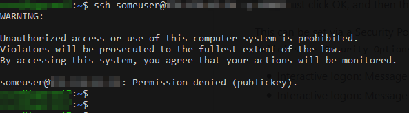
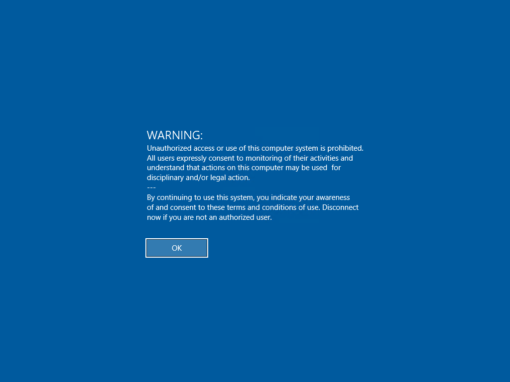
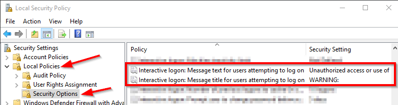

# Overview:

You typically want to put a warning message to prospective users connecting to SSH or a console. Below is how to configure that.

# On Linux:

There are two pieces needed for this. First, modify the `/etc/issue` (for local logins) and `/etc/issue.net` (for network logins) to have the content of the [issue.net](issue.net) file in this folder.

> NOTE: I do NOT leave the existing OS identifiers in those files. Those only help would-be attackers of the system and are useless to me and my end-users. So, the other content in the `issue` file should be removed.

Second, is you'd need to modify `/etc/ssh/sshd_config` and uncomment the line for `Banner` and have it point to `/etc/issue.net`. Restart your SSH server:

```
sudo systemctl restart sshd
```

and you should see the warning message before attempting to SSH into the machine.



# On Windows:

This works a little different. With this message enabled, when the user attempts to log in, they will see this banner prompt. They must click OK, and then they are allowed to attempt to login.



This can be set via a Security Policy. Launch: secpol.msc from the Start menu. Navigate into: `Security Settings` -> `Local Policies` -> `Security Options`. These options are set via:

- Interactive logon: Message title for users attempting to log on
- Interactive logon: Message text for users attempting to log on



Below is the text to use, and use `WARNING:` as the title:

```
Unauthorized access or use of this computer system is prohibited. 
All users expressly consent to monitoring of their activities and 
understand that actions on this computer may be used  for
disciplinary and/or legal action.
---
By continuing to use this system, you indicate your awareness
of and consent to these terms and conditions of use. Disconnect
now if you are not an authorized user.
```
